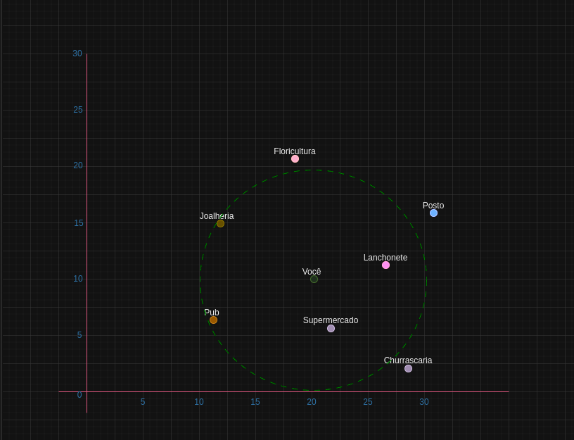

# Pontos de Interesse por GPS

Seu desafio será implementar um serviço para a empresa XY Inc., especializada na produção de excelentes receptores
GPS (Global Positioning System).
A diretoria está empenhada em lançar um dispositivo inovador que promete auxiliar pessoas na localização de pontos de
interesse (POIs), e precisa muito de sua ajuda.
Você foi contratado para desenvolver a plataforma que fornecerá toda a inteligência ao dispositivo. Esta plataforma deve
ser baseada em serviços REST, para flexibilizar a integração.

## Exemplo

Considere a seguinte base de dados de POIs:

- 'Lanchonete' (x=27, y=12)
- 'Posto' (x=31, y=18)
- 'Joalheria' (x=15, y=12)
- 'Floricultura' (x=19, y=21)
- 'Pub' (x=12, y=8)
- 'Supermercado' (x=23, y=6)
- 'Churrascaria' (x=28, y=2)

Dado o ponto de referência (x=20, y=10) indicado pelo receptor GPS, e uma distância máxima de 10 metros, o serviço deve
retornar os seguintes POIs:

- Lanchonete
- Joalheria
- Pub
- Supermercado

## Requisitos

- Cadastrar pontos de interesse, com 03 atributos: nome do POI, coordenada X (inteiro não negativo)
  e coordenada Y (inteiro não negativo).
- Os POIs devem ser armazenados em uma base de dados.
- Listar todos os POIs cadastrados.
- Listar os POIs por proximidade. Este serviço receberá uma coordenada X e uma coordenada Y, especificando um ponto de
  referência, bem como uma distância máxima (d-max) em metros. O serviço deverá retornar todos os POIs da base de dados
  que estejam a uma distância menor ou igual a d-max a partir do ponto de referência.

### Requisitos para rodar o projeto
- java versão 17

execute o projeto usando a idea, ou pelos comandos
```
gradle build
gradle run
```
acesse o swagger

[Swagger - Point reference ](http://localhost:8080/swagger-ui/index.html)


